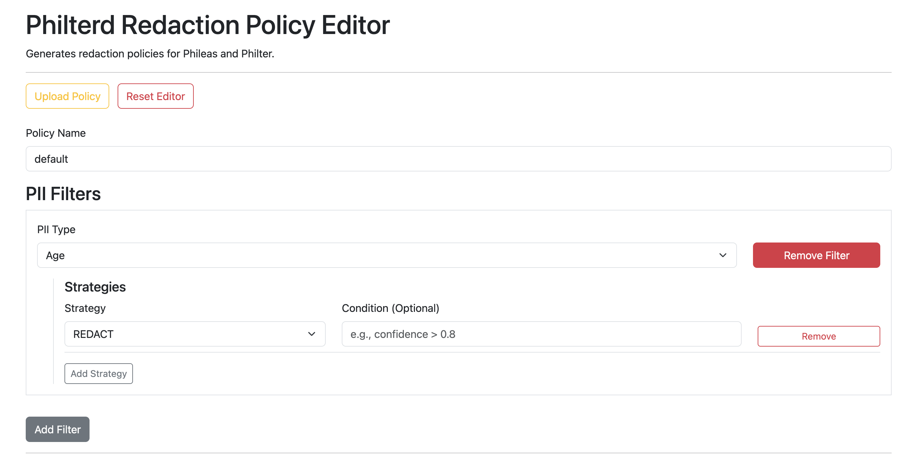

# Philterd Policy Editor

The Philterd Policy Editor provides a user-friendly web interface for building and managing redaction policies
for [Philter](https://www.github.com/philterd/philter) and [Phileas](https://github.com/philterd/phileas).

Documentation is available at https://philterd.github.io/philterd-redaction-policy-editor/



## Features

- **Dynamic Filter Selection**: Choose from over 30 PII/PHI filter types.
- **Multiple Strategies**: Configure multiple redaction strategies per filter with optional conditions.
- **Advanced Configuration**: Fine-tune PDF redaction settings, document splitting, and post-filtering.
- **Policy Management**: Load presets for common use cases (Legal, Financial), upload existing JSON policies to edit,
  and download or copy generated policies.
- **Policy Testing**: Test your policies against sample text directly in the browser and view detailed redaction
  explanations.
- **Docker Support**: Easy deployment using Docker and Docker Compose.

## Configuration

The Philterd Policy Editor can be configured using environment variables:

| Environment Variable           | Description                                | Default |
|--------------------------------|--------------------------------------------|---------|
| `HIDE_PII_WARNING`             | Set to `1` to hide the PII warning banner. | `0`     |

## Getting Started

### Using Docker

You can pull the Docker image directly from DockerHub:

```bash
docker run -p 8080:8080 philterd/philterd-redaction-policy-editor:latest
```

Alternatively, you can use `docker-compose`:

```bash
docker-compose build
docker-compose up
```

Either way, you can now access the editor at `http://localhost:8080`.

## License

Distributed under the [Apache License 2.0](http://www.apache.org/licenses/LICENSE-2.0).

Copyright 2026 [Philterd, LLC](https://www.philterd.ai)
