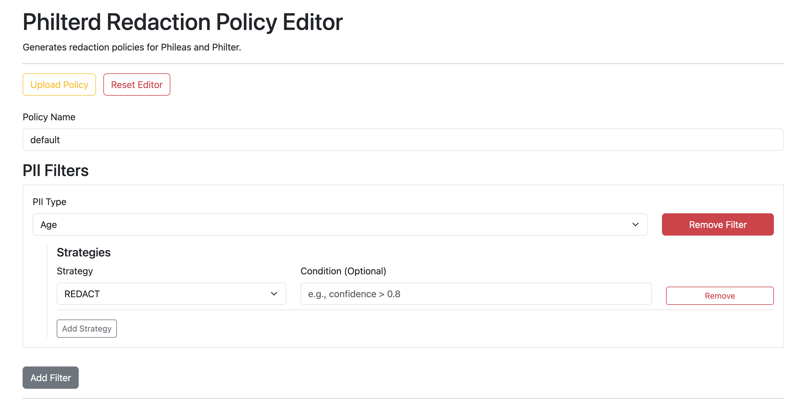

# Philterd Policy Editor

The Philterd Policy Editor provides a user-friendly web interface for building and managing redaction policies
for [Philter](https://www.github.com/philterd/philter) and [Phileas](https://github.com/philterd/phileas).

Documentation is available at https://philterd.github.io/philterd-redaction-policy-editor/



## Features

- **Schema-Driven**: The entire form is generated from the official redaction policy
  [JSON Schema](https://github.com/philterd/phisql/tree/main/schema). Generated policies are
  validated against the schema, so they always conform.
- **One Schema Version**: The editor authors the single policy schema version that the bundled
  Phileas runtime can run, so every policy it produces is one the engine understands. The schema
  lives at `src/main/resources/schemas/<version>/`, and moving to a new version is a matter of
  swapping that file (alongside the matching Phileas and PhiSQL versions), with no code changes.
- **Dynamic Filter Selection**: Choose from over 30 PII/PHI filter types.
- **Multiple Strategies**: Configure multiple redaction strategies per filter with optional conditions.
- **Advanced Configuration**: Fine-tune PDF redaction settings, document splitting, and post-filtering.
- **Policy Management**: Load presets for common use cases (Legal, Financial, Healthcare), upload
  existing JSON policies to edit, and download or copy generated policies.
- **Policy Testing**: Test your policies against sample text directly in the browser and view detailed
  redaction explanations. Testing runs the bundled Phileas engine, so it is available for the schema
  version that engine supports (see `phileas.supported-schema-version`).
- **Health and Metrics**: `/api/health` reports the status and application version, and
  `/actuator/health` and `/actuator/prometheus` cover probing and scraping.
- **Docker Support**: Easy deployment using Docker and Docker Compose.

## Configuration

The Philterd Policy Editor can be configured using environment variables:

| Environment Variable | Description                                                                         | Default |
|----------------------|-------------------------------------------------------------------------------------|---------|
| `HIDE_PII_WARNING`   | Set to `1` to hide the PII warning banner.                                          | `0`     |
| `CUSTOM_HEADER_FILE` | Path to a file containing custom HTML to be inserted into the `<head>` of the page. | (empty) |
| `CUSTOM_FOOTER_FILE` | Path to a file containing custom HTML to be inserted into the footer of the page.   | (empty) |

The schema version that the **Test Policy** feature can run is controlled by the
`phileas.supported-schema-version` application property (overridable with the
`PHILEAS_SUPPORTEDSCHEMAVERSION` environment variable). It must match the schema version supported by
the bundled Phileas runtime, which is also the version the editor authors.

## Health and metrics

Three endpoints are exposed for monitoring:

| Endpoint | Description |
|----------|-------------|
| `/api/health` | Returns `{"status":"UP","applicationVersion":"<version>"}` with HTTP 200 while the application is serving. |
| `/actuator/health` | Returns `{"status":"UP"}` with HTTP 200 while the application is serving. |
| `/actuator/prometheus` | JVM, process, Tomcat session, and HTTP request metrics in Prometheus text format. |

`/api/health` is the health contract shared across Philterd products, and is the one that reports the
application version. The two actuator endpoints match Philter.

All three are reachable without authentication. No actuator endpoint beyond the two above responds:
actuator exposure is limited to `health,prometheus` (`management.endpoints.web.exposure.include`) and
the discovery index at `/actuator` is turned off (`management.endpoints.web.discovery.enabled=false`),
so everything else under `/actuator` returns 404. Override either property to change what is
published.

`docker-compose.yml` uses `/actuator/health` as the container healthcheck, so `docker compose ps`
reports the application healthy only once it answers with an `UP` status.

## Schema version

The editor authors one redaction policy schema version, and it is the version the bundled Phileas
runtime can run, so a policy built here can always be tested here. The schema is copied verbatim from
[philterd/phisql](https://github.com/philterd/phisql/tree/main/schema).

| Bundled dependency | Version | Redaction policy schema |
|--------------------|---------|-------------------------|
| Phileas (Test Policy) | 4.2.0 | 1.1.0 |
| PhiSQL (Author with PhiSQL) | 1.2.0 | 1.1.0 |

All three move together. Advancing the schema means bumping Phileas to a release that supports the
new version, bumping PhiSQL to the release that compiles to it, swapping the bundled schema file, and
setting `phileas.supported-schema-version` to match. Exactly one schema must be bundled: the
application fails to start if it finds none or more than one, because the form has no way to choose
between two.

## Building

`mvn test` runs the Java tests and the JavaScript tests for the test-output highlighting, which
execute under Node. Skip the JavaScript tests with `-DskipJsTests`, or skip all tests with
`-DskipTests`, which the Docker build does.

## Getting Started

### Using Docker

You can pull the Docker image directly from DockerHub:

```bash
docker run -p 8080:8080 philterd/philterd-redaction-policy-editor:latest
```

Alternatively, you can use `docker-compose`:

```bash
docker-compose build
docker-compose up
```

Either way, you can now access the editor at `http://localhost:8080`.

## License

Distributed under the [Apache License 2.0](http://www.apache.org/licenses/LICENSE-2.0).

Copyright 2026 [Philterd, LLC](https://www.philterd.ai)
